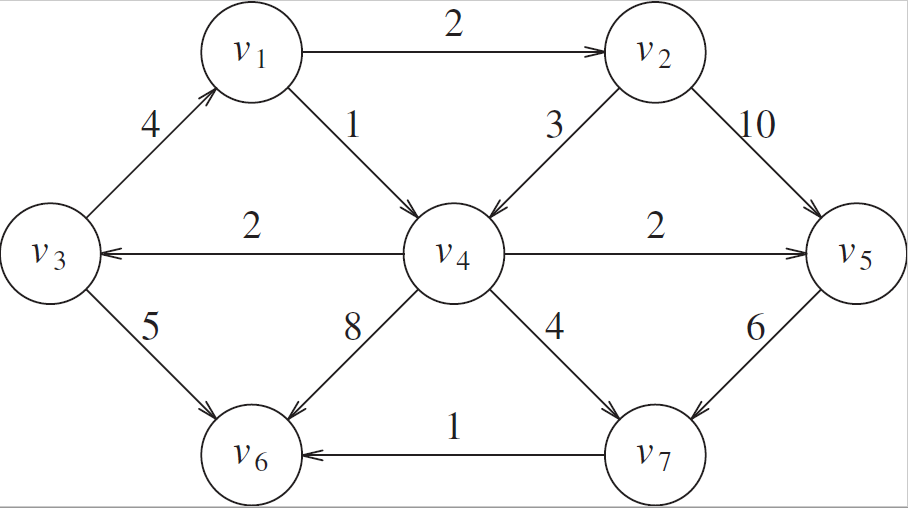

# Single-Node Multi-Node, Multi-Threaded Dijkstra's Algorithm for solving All Pairs Shortest Path

The implementation uses simulated nodes to concurrently execute multiple instances of the Single Source Shortest Path version of Dijkstra's algorithm. The current implementation
assumes that the number of nodes is less than the number of vertices in the graph. Therefore, each node handles multiple concurrent (multi-threaded) executions of Dijkstra's SSSP algorithm.
Future implementations will handle the instance where the number of processors exceeds the number of vertices, requiring multiple processors to work simultaneously on a given
instance of the SSSP problem.

Done sequentially, the algorithm has a complexity of O(|V|3). Done in parallel, the complexity is reduced by a factor of p, where p is the number of nodes.
The new complexity is therefore O(|V|3/p).

## Example

Graph:

Input file:

    v1
    v2
    2
    v1
    v4
    1
    ...

Output file:

    Shortest paths starting from v1
    v1: 0 [v1]
    v2: 2 [v1, v2]
    v4: 1 [v1, v4]
    v5: 3 [v1, v4, v5]
    v3: 3 [v1, v4, v3]
    v6: 6 [v1, v4, v7, v6]
    v7: 5 [v1, v4, v7]
    
    Shortest paths starting from v2
    v1: 9 [v2, v4, v3, v1]
    v2: 0 [v2]
    v4: 3 [v2, v4]
    v5: 5 [v2, v4, v5]
    v3: 5 [v2, v4, v3]
    v6: 8 [v2, v4, v7, v6]
    v7: 7 [v2, v4, v7]

    Shortest paths starting from v4
    v1: 6 [v4, v3, v1]
    v2: 8 [v4, v3, v1, v2]
    v4: 0 [v4]
    v5: 2 [v4, v5]
    v3: 2 [v4, v3]
    v6: 5 [v4, v7, v6]
    v7: 4 [v4, v7]
    
    Shortest paths starting from v5
    v1: NO PATH
    v2: NO PATH
    v4: NO PATH
    v5: 0 [v5]
    v3: NO PATH
    v6: 7 [v5, v7, v6]
    v7: 6 [v5, v7]
    
    Shortest paths starting from v3
    v1: 4 [v3, v1]
    v2: 6 [v3, v1, v2]
    v4: 5 [v3, v1, v4]
    v5: 7 [v3, v1, v4, v5]
    v3: 0 [v3]
    v6: 5 [v3, v6]
    v7: 9 [v3, v1, v4, v7]
    
    Shortest paths starting from v6
    v1: NO PATH
    v2: NO PATH
    v4: NO PATH
    v5: NO PATH
    v3: NO PATH
    v6: 0 [v6]
    v7: NO PATH

    Shortest paths starting from v7
    v1: NO PATH
    v2: NO PATH
    v4: NO PATH
    v5: NO PATH
    v3: NO PATH
    v6: 1 [v7, v6]
    v7: 0 [v7]

## v1.2 (1b) Tests

| # of Vertices | Min. Edges Per Node | Single Thread | 4 Threads |
|------------|------------|-------------|-------------|
| 100 | 5 | 24 ms | 19 ms |
| 1000 | 10 | 7891 ms | 2551 ms |

*v2.2 Tests skipped due to massive overhead of simulating network on a local machine.*

## v2.2 (2b) Updates

### TODO

## Usage

Once the Git repository has been cloned, simply enter the root and run

    sh ./build.sh

At this point, a 'target' folder should have been created. To simulate the distributed system, enter the 'target' folder and run

    java -cp ece465_hw2b-v2.2-jar-with-dependencies.jar edu.cooper.ece465.network.Coordinator

to get the Server end running. Then, run 
    
    java -cp ece465_hw2b-v2.2-jar-with-dependencies.jar edu.cooper.ece465.network.Workers

Changes to the graphs specifications, the number of locally simulated nodes, and the number of threads per node can be made in the config.json file.

Note: Please ensure the Server-end is run FIRST, otherwise provided code will not execute properly.

## Removal

To remove the compiled code, simply enter the root and run

    sh ./clean.sh

## Authors

 - Mark Koszykowski
 - Omar Thenmalai

## References

 - [Shortest Path Algorithms](https://web.stanford.edu/class/cs97si/07-shortest-path-algorithms.pdf)
 - [Log4j2 Logging](https://dzone.com/articles/log4j-2-configuration-using-properties-file)